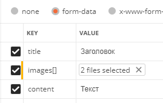
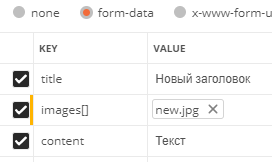

<p align="center"></p>


## API

- /api/register - регистрация<br>
Заголовок POST-запроса: Accept - application/json<br>
Тело запроса:
```
    {
        "name" : "Иван",
        "email" : "email@email.com",
        "password" : "123456",
        "c_password" : "123456",
        "address" : "Тамбов"
    }
```
Ответ:
```
    {
        "success": true,
        "data": {
            "token": "token",
            "name": "asd"
        },
        "message": "User register successfully."
    }
```

- /api/login - авторизация<br>
Заголовок POST-запроса: Accept - application/json<br>
Тело запроса:
```
    {
        "email" : "email@email.com",
        "password" : "123456"
    }
```
Ответ:
```
    {
        "success": true,
        "data": {
            "token_type": "Bearer ",
            "token": "token"
        },
        "message": "User authorizate successfully."
    }
```

- /api/logout - выход<br>
Заголовоки POST-запроса:<br>
Accept - application/json<br>
Authorization - Bearer token<br>
Ответ:
```
    {
        "message": "Unauthenticated."
    }
```

- /api/all_posts - получение списка всех постов<br>
Заголовок GET-запроса: Accept - application/json<br>
Ответ:
```
    {
        "success": true,
        "data": [
            {
                "post": {
                    "id": 1,
                    "title": "1",
                    "content": "1",
                    "user_id": 1,
                    "created_at": "07-07-2020 11:01",
                    "updated_at": "07-07-2020 11:01"
                },
                "images": [
                    {
                        "id": 1,
                        "title": "/storage/images/1234567890_image.jpg",
                        "alt": "1234567890_image.jpg",
                    },...
                ],
                "comments": [
                    {
                        "comment": {
                            "id": 20,
                            "text": "Комментарий",
                            "post_id": 1,
                            "user_id": 1,
                            "created_at": null,
                            "updated_at": null
                        },
                        "images": [
                            {
                                "id": 15,
                                "link": "/storage/images/1234567890_image.jpg",
                                "alt": "1234567890_image.jpg"
                            },...
                        ]
                    },...
                ]
            },...
        ],
        "message": "All posts with images retrieved successfully."
    }
```

- /api/posts - получение списка постов авторизированного пользователя<br>
Заголовоки GET-запроса:<br>
Accept - application/json<br>
Authorization - Bearer token<br>
Ответ:
```
    {
        "success": true,
        "data": [
            {
                "post": {
                    "id": 1,
                    "title": "1",
                    "content": "1",
                    "user_id": 1,
                    "created_at": "07-07-2020 11:01",
                    "updated_at": "07-07-2020 11:01"
                },
                "images": [
                    {
                        "id": 1,
                        "title": "/storage/images/1234567890_image.jpg",
                        "alt": "1234567890_image.jpg",
                    },...
                ]
            },...
        ],
        "message": "My posts retrieved successfully."
    }
```

- /api/posts - создание поста<br>
Заголовоки POST-запроса:<br>
Accept - application/json<br>
Authorization - Bearer token<br>
Тело запроса:
<br>
Ответ:
```
    {
        "success": true,
        "data": {
            "post": {
                "title": "Новый пост",
                "content": "Текст",
                "user_id": 2,
                "updated_at": "16-07-2020 07:51",
                "created_at": "16-07-2020 07:51",
                "id": 25,
                "user": {
                    "id": 2,
                    "name": "Иван",
                    "email": "email@email.com",
                    "email_verified_at": null,
                    "created_at": "15-07-2020 08:27",
                    "updated_at": "15-07-2020 08:27",
                    "address": "Тамбов"
                }
            },
            "images": [
                {
                    "id": 16,
                    "link": "/storage/images/1234567890_image.jpg",
                    "alt": "1234567890_image.jpg"
                },...
            ]
        },
        "message": "Post created successfully."
    }
```

- /api/posts/{post} - просмотр поста<br>
Заголовоки GET-запроса:<br>
Accept - application/json<br>
Authorization - Bearer token<br>
Ответ:
```
    {
        "success": true,
        "data": {
                "id": 23,
                "title": "Заголовок",
                "content": "Текст",
                "user_id": 2,
                "created_at": "16-07-2020 06:50",
                "updated_at": "16-07-2020 07:44"
            },
            "images": [
                {
                    "id": 14,
                    "link": "/storage/images/1234567890_image.jpg",
                    "alt": "1234567890_image.jpg"
                },...
            ]
        },
        "message": "Post retrieved successfully."
    }
```

- /api/posts/update - изменение поста<br>
Заголовоки POST-запроса:<br>
Accept - application/json<br>
Authorization - Bearer token<br>
Тело запроса:
<br>
Ответ:
```
    {
        "success": true,
        "data": {
            "post": {
                "id": 23,
                "title": "Новый заголовок",
                "content": "Текст",
                "user_id": 2,
                "created_at": "16-07-2020 06:50",
                "updated_at": "16-07-2020 07:44"
            },
            "images": [
                {
                    "id": 14,
                    "link": "/storage/images/1234567890_new.jpg",
                    "alt": "1234567890_new.jpg"
                },...
            ]
        },
        "message": "Post updated successfully."
    }
```

- /api/posts/delete - удаление поста<br>
Заголовоки DELETE-запроса:<br>
Accept - application/json<br>
Authorization - Bearer token<br>
Ответ:
```
    {
        "success": true,
        "data": {
            "post": {
                "id": 20,
                "title": "Заголовок",
                "content": "Текст",
                "user_id": 2,
                "created_at": "15-07-2020 09:39",
                "updated_at": "15-07-2020 09:39"
            },
            "images": [
                {
                    "id": 9,
                    "link": "/storage/images/1234567890_image.jpg",
                    "alt": "1234567890_image.jpg"
                },...
            ]
        },
        "message": "Post deleted successfully."
    }
```

-/api/images/ - удаление изображения<br>
Заголовок DELETE-запроса:<br>
Accept - application/json<br>
Ответ:
```
    {
        "success": true,
        "data": {
            "id": 7,
            "title": "1234567890_image.jpg",
            "user_id": 2,
            "table_id": 14,
            "table_type": "App\\Post",
            "created_at": "15-07-2020 09:13",
            "updated_at": "15-07-2020 09:13"
        },
        "message": "Image deleted successfully."
    }
```


- /api/comments - просмотр всех комментариев<br>
Заголовок GET-запроса:<br>
Accept - application/json<br>
Ответ:
```
    {
    "success": true,
    "data": [
        {
            "comment": {
                "id": 20,
                "text": "Комментарий",
                "post_id": 25,
                "user_id": 1,
                "created_at": "15-07-2020 09:13",
                "updated_at": "15-07-2020 09:13"
            },
            "images": [
                {
                    "id": 15,
                    "link": "/storage/images/1234567890_image.jpg",
                    "alt": "1234567890_image.jpg"
                }
            ]
        },...
    ],
    "message": "All comments retrieved successfully."
}
```

- /api/posts/{post}/comments - просмотр комментариев определённого поста<br>
Заголовоки GET-запроса:<br>
Accept - application/json<br>
Ответ:
```
    {
    "success": true,
    "data": [
        {
            "comment": {
                "id": 20,
                "text": "Комментарий",
                "post_id": 25,
                "user_id": 1,
                "created_at": "15-07-2020 09:13",
                "updated_at": "15-07-2020 09:13"
            },
            "images": [
                {
                    "id": 15,
                    "link": "/storage/images/1234567890_image.jpg",
                    "alt": "1234567890_image.jpg"
                }
            ]
        },
        ...
    ],
    "message": "Comments of post - 25 retrieved successfully.."
}
```

- /api/posts/{post}/comment - создание комментария<br>
Заголовоки POST-запроса:<br>
Accept - application/json<br>
Authorization - Bearer token<br>
Тело запроса:
<br>
Ответ:
```
    {
        "success": true,
            "data": {
                "comment": {
                "text": "Комментарий",
                "post_id": "25",
                "user_id": 2,
                "updated_at": "16-07-2020 10:27",
                "created_at": "16-07-2020 10:27",
                "id": 24,
                "user": {
                    "id": 2,
                    "name": "Иван",
                    "email": "email@email.com",
                    "email_verified_at": null,
                    "created_at": "15-07-2020 08:27",
                    "updated_at": "15-07-2020 08:27",
                    "address": "Тамбов"
                }
            },
            "images": [
                {
                    "id": 19,
                    "link": "/storage/images/1234567890_image.jpg",
                    "alt": "1234567890_image.jpg"
                },...
            ]
            }
        },
        "message": "Comment created successfully."
    }
```

- /api/posts/{post}/comment/update - изменение комментария<br>
Заголовоки PUT-запроса:<br>
Accept - application/json<br>
Authorization - Bearer token<br>
Тело запроса:
```
    {
        "text": "Новый текст комментария"
    }
```
Ответ:
```
    {
       "success": true,
        "data": {
            "text": "Новый текст комментария",
            "post_id": "1",
            "user_id": 1,
            "updated_at": "03-07-2020 12:35",
            "created_at": "03-07-2020 12:35",
            "id": 55,
            "user": {
                "id": 1,
                "name": "Иван",
                "email": "email@email.com",
                "email_verified_at": null,
                "created_at": "03-07-2020 12:35",
                "updated_at": "03-07-2020 12:35",
                "address": "Тамбов"
            }
        },
        "message": "Comment update successfully."
    }
```

- /api/posts/{post}/comment/delete - удаление комментария<br>
Заголовоки DELETE-запроса:<br>
Accept - application/json<br>
Authorization - Bearer token<br>
Ответ:
```
    {
       "success": true,
        "data": {
            "text": "Новый текст комментария",
            "post_id": "1",
            "user_id": 1,
            "updated_at": "03-07-2020 12:35",
            "created_at": "03-07-2020 12:35",
            "id": 55,
            "user": {
                "id": 1,
                "name": "Иван",
                "email": "email@email.com",
                "email_verified_at": null,
                "created_at": "03-07-2020 12:35",
                "updated_at": "03-07-2020 12:35",
                "address": "Тамбов"
            }
        },
        "message": "Comment delete successfully."
    }
```

- /api/profile - получение данных пользователя<br>
Заголовоки GET-запроса:<br>
Accept - application/json<br>
Authorization - Bearer token<br>
Ответ:
```
    {
        "success": true,
        "data": {
            "id": 1,
            "name": "Иван",
            "email": "email@email.com",
            "email_verified_at": null,
            "created_at": "03-07-2020 12:35",
            "updated_at": "03-07-2020 12:35",
            "address": "Тамбов"
        },
        "message": "User retrieved successfully."
    }
```

- /api/profile/update - изменение данных пользователя<br>
Заголовоки PUT-запроса:<br>
Accept - application/json<br>
Authorization - Bearer token<br>
Тело запроса:
```
    {
        "name" : "Иван",
        "email" : "email@email.com",
        "password": "000000",
        "c_password": "000000",
        "address": "Москва"
    }
```
Ответ:
```
    {
        "success": true,
        "data": {
            "id": 1,
            "name": "Иван",
            "email": "email@email.com",
            "email_verified_at": null,
            "created_at": "03-07-2020 12:35",
            "updated_at": "03-07-2020 12:35",
            "address": "Москва"
        },
        "message": "Profile updated successfully."
    }
```
